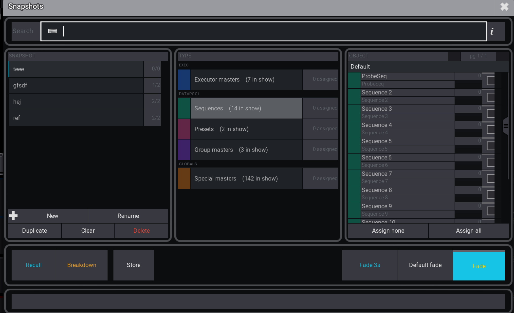

# Snapshots

**A snapshot recaller for your lighting console — store fader, group, executor and master positions as named snapshots, then recall them (with optional fade) from a GUI or a command.**

Program your looks once at 100%, then during the show drop groups, executors and masters into different positions — Verse, Chorus, Bridge, Solo, Breakdown — semi‑automatic and repeatable. Recall a snapshot from the manager, a macro and the assigned fader values move to their stored levels with a optional fade. It's the missing semi-auto "mix it live" layer for a grandMA3 show.



---

> ## ⚠️ Alpha — UNTESTED and "vibe coded"
>
> This is **early, work‑in‑progress software that is UNTESTED in production**, and it was **"vibe coded"** — built largely through conversational AI assistance rather than careful hand engineering. That means:
>
> - **It has not been road‑tested on a live show.** Expect rough edges and bugs.
> - **No guarantees.** It may misbehave or break on a firmware/version you're not expecting.
> - **Try it on a scratch show first** — never on a live production showfile you can't afford to lose.
>
> Shared in the hope it's useful and that the community can help improve it. You've been warned. 🙂

---

## What it does

From inside grandMA3 you can:

- 🎚️ **Store** the current position of executors, group masters, special masters and datapool objects (sequences / presets / groups) into a named snapshot — the tick in the Object pane *is* the assignment.
- ▶️ **Recall** a snapshot and have every assigned fader move to its stored level, **with a fade** (or instant, via the Fade/Snap toggle).
- 🧱 **Breakdown** — recall a snapshot's targets to a breakdown state (a separate playback intent for stripped‑back moments).
- 🗂️ **Organise** by a 3‑pane drill‑down — **Snapshot ▸ Type ▸ Object** — with objects grouped under Executor masters · Datapool (Sequences / Presets / Group masters) · Global (Special) masters.
- 🔍 **Search live** — filter the Type and Object panes by name as you type.
- ⏱️ **Automate** — drive Recall / Store / Clear from a **macro or timecode** with a simple keyword command (same engine as the GUI).
- 💾 **Persist** — snapshots live inside the showfile (a shared GlobalVar), so they survive reloads and reboots and travel with the show.

Everything runs **inside the console** — no companion server, no browser.

## Requirements

- **grandMA3** onPC (macOS or Windows) or console — developed against firmware **2.4.2.2**.
- Nothing else to install. The optional feedback form uses the HTTP tool already on your platform (**curl** on onPC, **busybox wget** on the console).

## Install

1. Download / clone this repository.
2. Copy the plugin folder into your grandMA3 plugin DataPool:
   - **macOS:** `~/MALightingTechnology/gma3_library/datapools/plugins/Snapshots/`
   - **Windows:** `%PROGRAMDATA%\MALightingTechnology\gma3_library\datapools\plugins\Snapshots\`

   Keep the `lib/` subfolder structure intact — the manifest references those paths.
3. In MA3, import it from the Plugins pool (or it's auto‑discovered on the next show open), then run it.

> A small deploy helper for onPC development lives in `scripts/deploy.py` (copies the tree into your local plugin DataPool). For multi‑file plugins, restart onPC after deploying so sub‑module changes are picked up.

## Usage

### The manager (GUI)

Press the plugin tile to open the manager.

1. **＋New** a snapshot in the Snapshot pane (rename / duplicate / clear / delete from the button bar).
2. Pick a **Type**, then **tick** the objects in the Object pane to assign them — the tick captures their current level.
3. Select a snapshot and press **Recall** (or **Breakdown**) in the playback bar. Toggle **Fade / Snap** and set the fade time there.

### Macros & timecode (keyword command)

The plugin also takes an argument string, so the same actions run from a macro line or a timecode event. Empty argument → opens the manager; a non‑empty argument runs the command.

**Grammar:** `<verb> <name> [key=value ...] [flag ...]`
- **verb** — `recall` · `store` · `clear`
- **name** — the snapshot name (quote it if it contains spaces)
- **fade=`N`** — fade time in seconds (recall)
- **breakdown** — recall to the breakdown state

Examples (as macro lines):

```
Plugin "Snapshots" "recall Verse"
Plugin "Snapshots" "recall Chorus fade=3"
Plugin "Snapshots" "recall Breakdown breakdown"
Plugin "Snapshots" "store Solo"
Plugin "Snapshots" "clear Verse"
Plugin "Snapshots" "recall ""Guitar Solo"" fade=1.5"
```


## Support this project 💛

If Snapshots helps your show, consider chipping in — it genuinely helps:

### **→ [community.smidn.com/donate](http://community.smidn.com/donate)**

You can also reach the donation QR any time from **About → Donate** inside the plugin (scan it with your phone), and send bug reports from **About → Feedback**.

## How it's built

- **grandMA3‑bundled Lua 5.4**, multi‑file ComponentLua plugin (global‑namespace pattern).
- **Native MA3 UI** — the manager is a `ScreenOverlay` / `BaseInput` window of MA3 Lua widgets (no web view).
- **Persistence** — the whole snapshot collection is one JSON string in a show‑file `GlobalVars()` blob (shared, survives reload/reboot, last‑write‑wins).
- **Recall engine** — a plugin‑owned uniform fade (a single 0→100 value animation) drives assigned faders; the GUI and the macro command share one engine.
- **Feedback** goes over the platform HTTP tool via a single `io.popen` boundary (curl on onPC, busybox wget on the console); the donation **QR** is drawn by a small pure‑Lua QR encoder (`lib/qrcode.lua`).
- Host‑side unit tests run under a self‑contained Lua runner: `lua tests/run_all.lua`.
